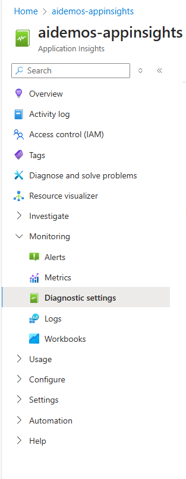
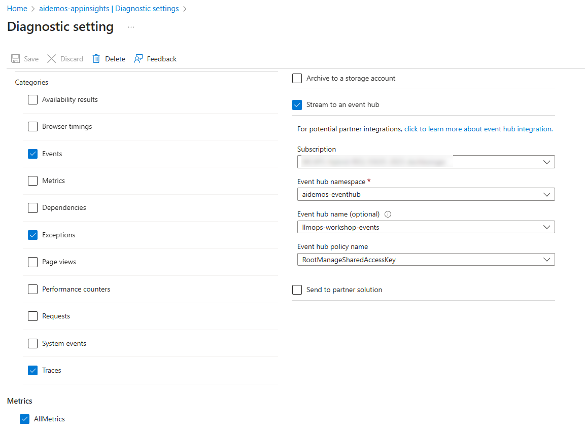
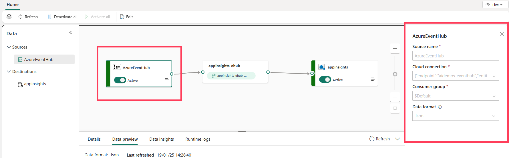
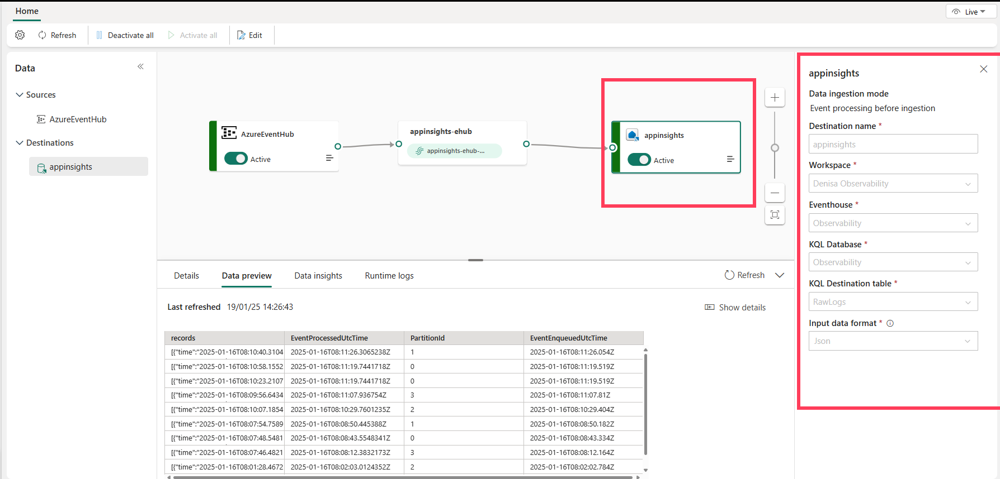

## Monitoring and tracing  

Sending logs, traces and metrics to Azure Application Insights 

OpenTelemetry: OpenTelemetry is a set of libraries used to collect and export telemetry data (metrics, logs, and traces) for analysis in order to understand your software's performance and behavior.
We can use Azure Application Insights to export from our apps:
- Logs: Log refers to capturing of logging, exception and events.  
- Metrics: Metric refers to recording raw measurements with predefined aggregation and sets of attributes for a period in time.  
- Traces: Trace refers to distributed tracing. A distributed trace is a set of events, triggered as a result of a single logical operation, consolidated across various components of an application. In particular, a Trace can be thought of as a directed acyclic graph (DAG) of Spans, where the edges between Spans are defined as parent/child relationship. 
 
### Application Insights

In order to run the notebooks in this folder, you need to:
- Configure Azure Application Insigts. [See instructions here](https://learn.microsoft.com/en-us/azure/azure-monitor/app/app-insights-overview)  
- Get the Application Insights connection string from the Azure Portal and place it in the .env file:  
```
APPLICATIONINSIGHTS_CONNECTION_STRING = "<your-application-insights-connection-string>"
```  

### Microsoft Fabric
If you want to stream the events to Ms Fabric do as follows:
- Create an Azure Events hub. [See instructions here](https://learn.microsoft.com/en-us/azure/event-hubs/event-hubs-create)  
- Go to the Application Insights we created above. 
- Click on Diagnostic Settings   
    
- Click on "Add Diagnostic settings"  
- Define logs export as follows and connect the export to the events hub we created.
    
- In Microsoft Fabric we will stream the logs from the events hub to Eventhouse DB (Kusto)  
- Create an Eventhouse DB called "Observability"
- Create an eventstream to ingest Data into our Database.
- Define the input and connect to the Events hub we created above
    
- Define the output and connect to the Eventhouse DB and create a new Table called "RawLogs"  
    

### Visualizing the logs in Microsoft Fabric  
- Go to the Eventhouse DB ("Observability")
- Click on "Query with code"  
- Paste the following queries and run
```
// see 1 record per row
RawLogs
| extend records =  parse_json(records)
| extend item = (records)
| mv-expand item
| extend customDimensionsObject =  parse_json(item.Properties)
| extend test_run_id = tostring(customDimensionsObject.test_run_id)
| extend llm_version = customDimensionsObject.llm_version
| extend llm_model = customDimensionsObject.llm_model
| extend temperature = customDimensionsObject.temperature
| extend query_id = toint(customDimensionsObject.query_id)
| extend prompt_name = tostring(customDimensionsObject.prompt_name)
| extend coherence = toreal(customDimensionsObject.coherence)
| extend groundedness = toreal(customDimensionsObject.groundedness)
| extend relevance = toreal(customDimensionsObject.relevance)


// graph 
RawLogs
| extend records =  parse_json(records)
| extend item = (records)
| mv-expand item
| extend customDimensionsObject =  parse_json(item.Properties)
| extend test_run_id = tostring(customDimensionsObject.test_run_id)
| extend llm_version = customDimensionsObject.llm_version
| extend llm_model = customDimensionsObject.llm_model
| extend temperature = customDimensionsObject.temperature
| extend query_id = toint(customDimensionsObject.query_id)
| extend prompt_name = tostring(customDimensionsObject.prompt_name)
| extend coherence = toreal(customDimensionsObject.coherence)
| extend groundedness = toreal(customDimensionsObject.groundedness)
| extend relevance = toreal(customDimensionsObject.relevance)
| summarize 
    AvgCoherence = avg(coherence),
    AvgGroundedness = avg(groundedness), 
    AvgRelevance = avg(relevance)
by 
    test_run_id,
    prompt_name


// graph ADX
RawLogs
| extend records =  parse_json(records)
| extend item = (records)
| mv-expand item
| extend customDimensionsObject =  parse_json(item.Properties)
| extend test_run_id = tostring(customDimensionsObject.test_run_id)
| extend llm_version = customDimensionsObject.llm_version
| extend llm_model = customDimensionsObject.llm_model
| extend temperature = customDimensionsObject.temperature
| extend query_id = toint(customDimensionsObject.query_id)
| extend prompt_name = tostring(customDimensionsObject.prompt_name)
| extend coherence = toreal(customDimensionsObject.coherence)
| extend groundedness = toreal(customDimensionsObject.groundedness)
| extend relevance = toreal(customDimensionsObject.relevance)
| summarize 
    AvgCoherence = avg(coherence),
    AvgGroundedness = avg(groundedness), 
    AvgRelevance = avg(relevance)
by 
    test_run_id,
    prompt_name
|sort by prompt_name
| render columnchart  

```


 